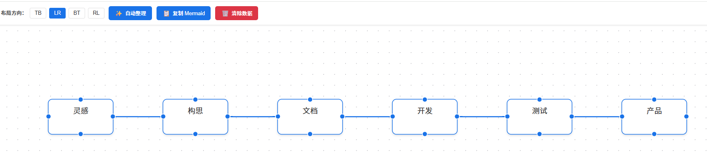
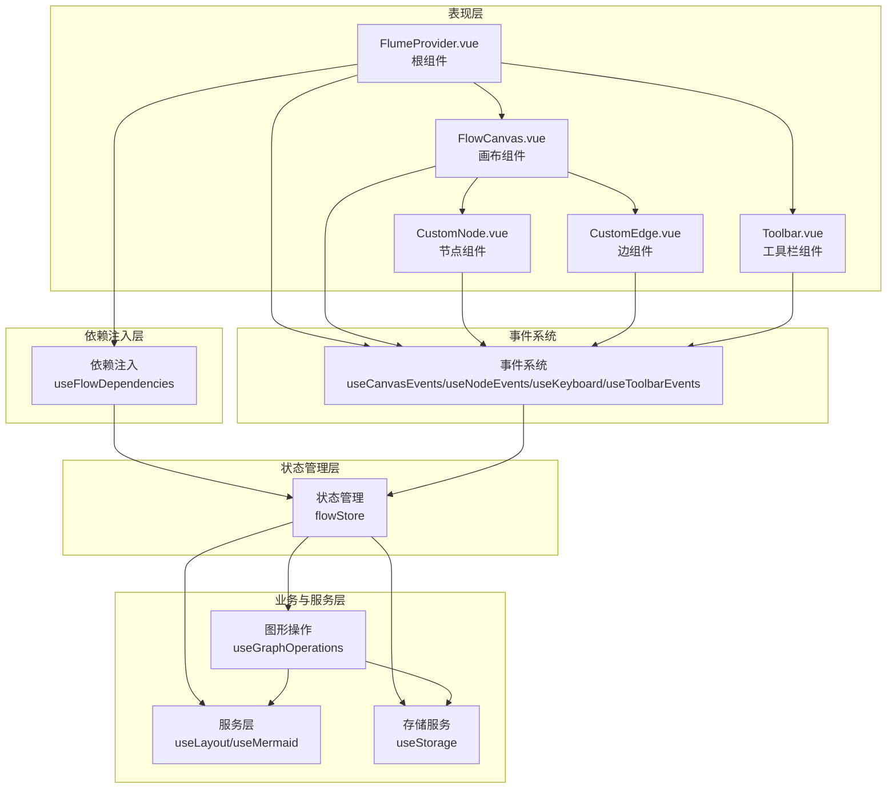

# Flume
----
Flume 是一个可视化图形编辑工具——你拖拽节点、连接线条，它实时生成 Mermaid 代码。

画架构图，本应像你思考一样流畅。  
Flume 不关心你画的是什么系统，只关心你画得顺手：

- **从手绘的直觉出发**，而不是从工具的约束出发。拖拽、旋转、自动整理，每一步都回应你的操作惯性。
- **底层是文本，所见即所得**。你可以手动改代码，也可以直接在画布上调整，两者实时同步。
- **与 AI 协作，而不是被它替代**。Flume 生成的 Mermaid 代码可以直接喂给 AI 做进一步分析；AI 生成的草图也可以粘贴进来，你继续手动完善。

它不是又一个画图软件。它是你思考时的草稿纸，是你和 AI 讨论架构时的共同语言。  
你负责直觉，它负责呈现——仅此而已。

<p align="center">
  
</p>

*从灵感到产品，每一步都可以被画出来——包括这张图本身。*

---
## 核心能力

- 🎯 **直观编辑**：拖拽式操作，所见即所得的图形编辑体验
- 🔄 **自动布局**：智能整理节点位置，支持多种布局方向
- 📝 **Mermaid 集成**：实时生成和同步 Mermaid 代码
- ⌨️ **键盘导航**：丰富的快捷键，提升编辑效率
- 💾 **本地存储**：数据持久化到本地，刷新页面不丢失
- 🤖 **AI 协作**：生成的 Mermaid 代码可直接与 AI 交互

## 架构概览



Flume 采用五层架构设计：

1. **表现层**：包含 FlumeProvider 根组件、画布、节点、边和工具栏等核心组件，负责界面渲染和用户交互
2. **事件系统**：处理用户交互事件，如点击、拖拽、键盘操作等，连接表现层和状态管理层
3. **依赖注入层**：通过 `useFlowDependencies` 提供应用所需的依赖
4. **状态管理层**：核心控制中心，管理应用状态，协调各模块工作
5. **业务与服务层**：包含图形操作、布局服务、Mermaid 生成和存储服务

**核心依赖关系**：
- 所有表现层组件（FlumeProvider、FlowCanvas、CustomNode、CustomEdge、Toolbar）都通过事件系统与状态管理层交互
- FlumeProvider 作为根组件，提供依赖注入并组合其他组件
- 依赖注入层为应用提供统一的状态管理和服务
- 状态管理层管理和调用业务与服务层的功能
- 图形操作模块执行具体的图形操作逻辑，依赖服务层和存储服务

这种架构设计确保了数据流向的清晰性，所有操作都通过事件系统和状态管理层协调，避免了直接的跨层调用，提高了系统的可维护性和扩展性。同时，通过依赖注入机制，使得组件之间的耦合度降低，更加易于测试和扩展。

---
## 功能列表

- **拖拽节点**：自由拖拽节点到画布任意位置
- **连接节点**：通过拖拽创建节点间的连接
- **自动布局**：支持从上到下（TB）、从下到上（BT）、从左到右（LR）、从右到左（RL）四种布局方向
- **Mermaid 导入导出**：实时生成 Mermaid 代码，支持复制到剪贴板
- **键盘导航**：Tab 添加子节点，Ctrl+Enter 添加兄弟节点，Delete 删除选中元素，方向键导航
- **节点编辑**：双击节点进入编辑模式，支持多行文本
- **本地存储**：自动保存到本地存储，刷新页面数据不丢失
- **视口控制**：支持缩放、平移画布
- **选中状态管理**：清晰的选中状态视觉反馈

---
## 使用方式

详细使用示例请参考 `examples/vue-example/` 目录，包含完整的项目配置和代码示例。

**高级用法**（未经测试）：如果您想自定义工具栏或画布，可以使用插槽：

```vue
<template>
  <div style="width: 100vw; height: 100vh;">
    <FlumeProvider>
      <template #toolbar>
        <MyCustomToolbar />
      </template>
      <template #canvas>
        <MyCustomCanvas />
      </template>
    </FlumeProvider>
  </div>
</template>

<script setup>
import { FlumeProvider } from '@soulglad/flume'
import '@soulglad/flume/style.css'
</script>
```

**注意**：使用此方式需要您的项目已安装 Vue 3。

### 自定义配置（未经测试）

您可以自定义画布的背景样式和其他配置：

```vue
<template>
  <div style="width: 800px; height: 600px;">
    <FlumeProvider
      :background="{
        pattern: 'dots',
        patternColor: '#b1b1b7',
        gap: 20,
        size: 1,
        color: '#ffffff'
      }"
      :show-controls="true"
      :show-background="true"
    />
  </div>
</template>

<script setup>
import { FlumeProvider } from '@soulglad/flume'
import '@soulglad/flume/style.css'
</script>
```

**背景配置选项**：
- `pattern`: 背景图案类型（'dots' | 'lines' | 'cross'）
- `patternColor`: 图案颜色
- `gap`: 图案间距
- `size`: 图案大小
- `color`: 背景颜色

**其他配置选项**：
- `show-controls`: 是否显示控制按钮（缩放、平移）
- `show-background`: 是否显示背景

**注意**：使用此方式需要您的项目已安装 Vue 3。

---
### 基础使用

1. **创建节点**：点击画布空白处，然后按 Tab 键添加子节点
2. **连接节点**：从一个节点的连接点拖拽到另一个节点
3. **编辑节点**：双击节点进入编辑模式，输入文本后按 Enter 确认
4. **调整布局**：使用工具栏的布局方向按钮切换布局
5. **复制 Mermaid 代码**：点击工具栏的 "复制 Mermaid" 按钮
6. **添加兄弟节点**：选中节点后按 Ctrl+Enter
7. **删除元素**：选中节点或边后按 Delete 键